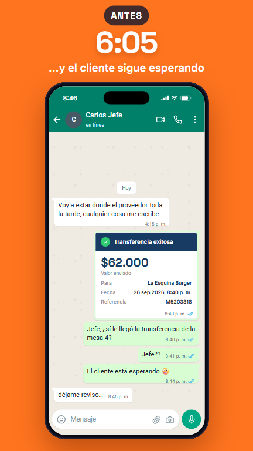
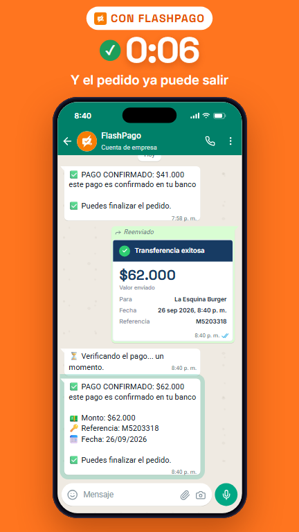
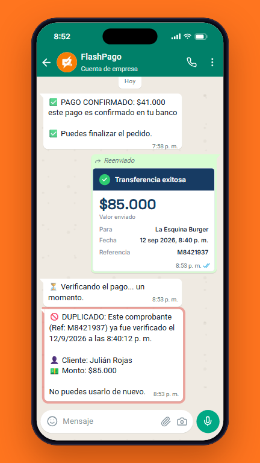
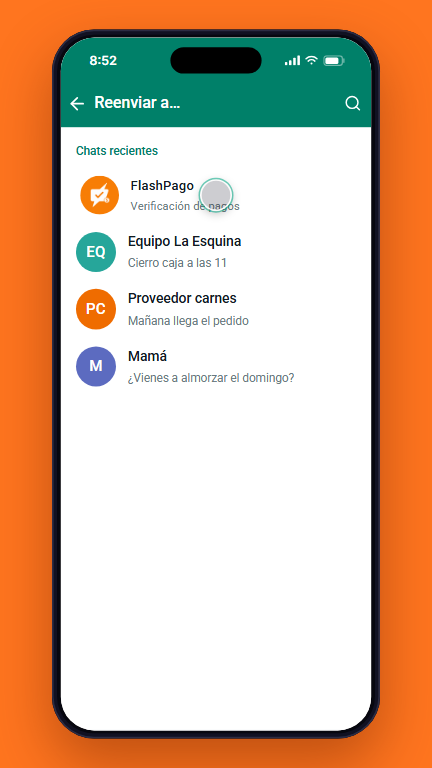
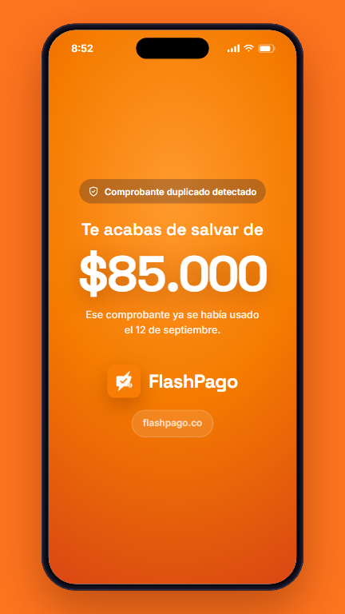

<p align="center">
  
</p>

<h1 align="center">FlashPago</h1>

<p align="center">
  <b>Verificación automática de pagos por transferencia, directo en WhatsApp.</b><br>
  No somos una billetera: no movemos tu plata. Solo confirmamos que el pago sí llegó.
</p>

<p align="center"><a href="https://flashpago.co">flashpago.co</a></p>

El cliente paga por transferencia y le manda el comprobante al empleado. El
empleado lo reenvía al bot de FlashPago por WhatsApp, y el bot lee el
comprobante, lo compara con el correo que manda el banco y en segundos
responde si la plata sí llegó, si ese comprobante ya se había usado o si
todavía no aparece. Al cierre del turno, el dueño recibe el resumen del día.

> FlashPago está en uso real en un restaurante en Colombia y se encuentra en desarrollo activo.

## ✨ Así se ve

<table>
  <tr>
    <td align="center"><br><sub>Antes: preguntarle al jefe</sub></td>
    <td align="center"><br><sub>Con FlashPago: confirmado en segundos</sub></td>
    <td align="center"><br><sub>Comprobante repetido detectado</sub></td>
  </tr>
  <tr>
    <td align="center"><br><sub>Un toque: reenviar al bot</sub></td>
    <td align="center"><br><sub>Plata que no se pierde</sub></td>
    <td align="center"><br><sub>6 minutos vs. 6 segundos</sub></td>
  </tr>
</table>

<sub>Capturas con datos de ejemplo.</sub>

## Qué hace

- ✅ **Confirma cada transferencia** contra el correo del banco (Bancolombia, Nequi y BBVA / Bre-B).
- 🚫 **Detecta comprobantes repetidos**: un comprobante ya usado no se confirma dos veces.
- ⏳ **Espera al banco**: si el correo llega tarde, lo sigue buscando 15 minutos y avisa solo.
- 📊 **Panel web** con los pagos del día, estadísticas, cierre de caja y gastos.
- 🔔 **Avisos al dueño por WhatsApp**: cierre del turno, pagos sin confirmar e ingresos sin comprobante.

**Hecho con** Node.js, Express, SQLite, React (Vite), Claude para leer los comprobantes, Gmail API, WhatsApp Cloud API de Meta y Wompi.

---

## 🛠️ Documentación técnica

Sistema de verificacion automatica de pagos. No es un bot: es una plataforma
de verificacion de pagos que usa WhatsApp (API oficial de Meta, con OpenWA
como respaldo) como canal de entrada. El proyecto recibe comprobantes por WhatsApp, extrae sus datos con
Claude, comprueba el pago mediante Gmail y registra el resultado en SQLite.
Tambien incluye un dashboard web con login, reportes y administracion de
usuarios. Esta instancia esta configurada para Vinson Burgers, pero la
suscripcion y el cobro son a FlashPago (ver seccion Wompi).

El codigo esta organizado en modulos separados por responsabilidad, de modo
que `index.js` actua solo como punto de entrada del servidor y el resto de la
logica vive en las carpetas `routes/` y `bot/`.

## Flujo principal

1. Un empleado reenvia al bot la imagen del comprobante por WhatsApp.
2. WhatsApp (la API oficial de Meta, u OpenWA como respaldo) envia el evento a `POST /webhook`.
3. El servidor valida el secreto del webhook y que el remitente este autorizado.
4. Claude extrae banco, monto, referencia y fecha del comprobante.
5. Gmail busca una notificacion reciente del banco (Bancolombia, Nequi o BBVA) con el mismo monto.
6. Si Gmail no confirma el pago, queda como "no encontrado" y el bot lo sigue
   buscando cada 2 minutos durante 15 (el correo del banco a veces llega
   tarde). Si llega, confirma el pago y le avisa al empleado; si no, les avisa
   al empleado y al administrador para que lo revisen en la app del banco.
7. El resultado se guarda en la tabla `pagos` y se responde por WhatsApp.
8. En el cierre de turno (15 minutos despues de la hora de cierre) sale el
   reporte del dia: pagos que llegaron tarde y pagos no confirmados (todos los
   planes), transferencias sin comprobante y el resumen del dia (desde Premium
   y en la prueba gratis).

## Planes

Los topes y precios viven en `db.js` (`LIMITES_PLAN`, `PRECIOS_CENTAVOS`,
`LIMITES_USUARIOS`) y se repiten para mostrar en la landing, el registro y el
dashboard.

| Plan | Mensual | Anual (2 meses gratis) | Comprobantes/mes | Usuarios |
|---|---|---|---|---|
| Básico | $39.900 | $399.000 | 300 | 3 |
| Premium | $79.900 | $799.000 | 1.000 | 5 |
| Premium Plus | $109.900 | $1.099.000 | 3.000 | 8 |
| Empresarial | a la medida | — | sin tope (uso razonable: 10.000/mes por sede) | sin tope |

Al llegar al tope el bot sigue verificando un 10% más de cortesía
(`topeConMargen`) y le avisa al admin (`limite_alcanzado`); pasado ese margen se
detiene y vuelve a avisar (`limite_agotado`). Cada aviso sale una vez por mes.
Un negocio con `plan_ilimitado` no tiene tope de nada.

La comprobacion de Gmail usa el monto exacto.

## Funcionalidades

- Bot de WhatsApp integrado con OpenWA.
- Lectura de comprobantes con Claude API o modo local de demostracion.
- Verificacion de pagos por Gmail API.
- Deteccion de comprobantes duplicados durante los ultimos siete dias.
- Registro de pagos y comprobantes en SQLite.
- Login del dashboard con JWT.
- Contraseñas de usuarios almacenadas con PBKDF2 y salt aleatorio.
- Roles `admin` y `empleado`.
- Dashboard React servido por el mismo servidor Express.
- Totales diarios, estadisticas, pagos pendientes y duplicados.
- Busqueda de pagos por nombre del cliente.
- Exportacion CSV de los ultimos treinta dias.
- Gestion de usuarios para administradores.
- Reportes automaticos por WhatsApp segun el horario configurado en `index.js`.

## Estructura

```text
flashpago-backend/
├── index.js              # Arranca el servidor, monta rutas y programa reportes
├── config.js             # Variables de entorno centralizadas
├── auth.js               # Middlewares de autenticacion: JWT, roles, login
├── db.js                 # Conexion SQLite, esquema y consultas
├── ocr.js                # Extraccion de datos con Claude o patrones locales
├── gmail.js              # Busqueda y confirmacion por Gmail API
├── verificador.js        # Respaldo cuando Gmail no confirma el pago
├── generar-token.js      # Autorizacion inicial de Gmail
├── routes/
│   ├── api.js            # Endpoints del dashboard (login, usuarios, reportes...)
│   └── webhook.js        # Procesamiento de mensajes de WhatsApp
├── bot/
│   ├── comandos.js       # Comandos de texto del bot (hola, total, buscar...)
│   ├── pendientes.js     # Pagos "no encontrado": plazo de 15 min y cierre de turno
│   ├── reportes.js       # Reportes del cierre de turno
│   ├── state.js          # Estado en memoria (historial)
│   ├── openwa.js         # Envio de mensajes e imagenes por OpenWA
│   └── utils.js          # Utilidades (formatear resultado, guardar foto)
├── package.json          # Dependencias del backend
├── vinsonbot.db          # Base SQLite local; no debe subirse al repositorio
├── comprobantes/         # Imagenes guardadas localmente
└── dashboard/
    ├── src/              # Aplicacion React
    ├── public/
    └── package.json      # Dependencias y scripts del frontend
```

## Requisitos

- Node.js 20 o una version compatible con las dependencias instaladas.
- Una instancia de OpenWA accesible desde el backend.
- Una cuenta de Gmail con las notificaciones bancarias, si se usa Gmail.
- Una clave de Claude, si se desea OCR con IA.

## Instalacion

Desde la raiz:

```bash
npm install
cd dashboard
npm install
npm run build
cd ..
node index.js
```

El backend sirve el dashboard compilado desde `dashboard/build`. En desarrollo
del frontend se puede usar:

```bash
cd dashboard
npm start
```

El proxy del dashboard apunta a `http://localhost:3000`.

## Configuracion `.env`

Crea un archivo `.env` en la raiz. Nunca subas sus valores al repositorio.

```env
# Servidor y negocio
PORT=3000
NEGOCIO_NOMBRE=VINSON PAGOS IA

# OpenWA
OPENWA_URL=http://localhost:2785
OPENWA_API_KEY=tu_clave_de_openwa
OPENWA_SESSION=tu_sesion

# Seguridad del dashboard
JWT_SECRET=un_secreto_largo_y_aleatorio

# Seguridad de entradas de OpenWA
INBOUND_WEBHOOK_SECRET=otro_secreto_largo_y_aleatorio

# Integraciones opcionales
CLAUDE_API_KEY=tu_clave_de_claude
MY_WHATSAPP=573000000000@c.us

# Wompi (pasarela de pagos de la suscripción de FlashPago)
WOMPI_AMBIENTE=test
WOMPI_PUBLIC_KEY=pub_test_xxx
WOMPI_PRIVATE_KEY=prv_test_xxx
WOMPI_INTEGRITY_SECRET=tu_secreto_de_integridad
WOMPI_EVENTS_SECRET=tu_secreto_de_eventos

# Control de reportes y verificaciones en festivos / fin de semana (true/false)
HABILITAR_VERIFICACION_FESTIVOS=true
HABILITAR_VERIFICACION_FIN_SEMANA=true
HABILITAR_REPORTE_FESTIVOS=true
HABILITAR_REPORTE_FIN_SEMANA=true
```

`JWT_SECRET` es obligatorio: el servidor no inicia sin el. El login del
dashboard no usa credenciales fijas; los usuarios y sus contraseñas se
almacenan en la tabla `usuarios` de la base de datos y se gestionan desde el
dashboard por un administrador. `MY_WHATSAPP` recibe las alertas de pagos que
requieren revision manual.

Las variables `HABILITAR_*` permiten decidir si el bot envia el cierre de
turno (pagos no confirmados y reporte diario) en días festivos o fines de
semana. Si se ponen en `false`, esos procesos se omiten los días
correspondientes (por ejemplo, si en un festivo el negocio no opera y no hay
movimientos que revisar).

## Configurar Gmail

1. Habilita Gmail API en Google Cloud.
2. Crea credenciales OAuth de tipo aplicacion de escritorio.
3. Guarda el archivo descargado como `credentials.json` en la raiz.
4. Ejecuta una sola vez:

   ```bash
   node generar-token.js
   ```

5. Completa el flujo de autorizacion. Se generara `token.json`.

El filtro actual busca mensajes no leidos recientes de dominios de
Bancolombia. Cuando encuentra una coincidencia, marca el correo como leido.
`credentials.json` y `token.json` contienen material sensible y estan
excluidos por `.gitignore`.

## Registro automático y aviso inmediato de Gmail

Cada negocio elige en **Configuración → Registro de pagos** entre *Manual, con comprobante*
(por defecto) y *Automático*. En automático, `bot/auto-registro.js` lee los correos de
Bancolombia, Nequi y BBVA y guarda cada ingreso como pago (`fuente = 'auto'`), con el mismo
filtro de `esIngreso` (no cuentan retiros, compras, envíos ni nómina). Al activarlo, el
dashboard corre las comprobaciones de `bot/preparacion-automatico.js` (conexión, avisos del
banco, velocidad, plan y pantallazos pendientes). Si al activarlo hay pantallazos esperando su
correo, el primer correo del mismo monto que llegue dentro de su plazo (15 min) los confirma y
avisa al cajero, en vez de crear un pago nuevo.

Al activar el automático se agregan también los ingresos **de hoy** (desde las 00:00, hora de
Colombia) que todavía no estén registrados, por ejemplo los de un cajero que olvidó mandar el
pantallazo; los de días anteriores no se importan. Un pago de hoy que el administrador confirmó
a mano (`fuente = 'manual_admin'`) y sin correo se vincula al correo del mismo monto en vez de
contarse otra vez.

Por defecto la revisión corre cada 10 segundos. Para **registrar en el momento en que llega el
correo** (sin esperar la revisión) se usa el aviso inmediato de Gmail por Pub/Sub; es opcional:

1. En Google Cloud (el mismo proyecto de las credenciales OAuth), habilita **Cloud Pub/Sub API**.
   Puede exigir que el proyecto tenga facturación activa; el uso es mínimo.
2. Crea un **tema** (por ejemplo `gmail-avisos`).
3. En los permisos del tema, da el rol **Publicador de Pub/Sub** a
   `gmail-api-push@system.gserviceaccount.com`.
4. Crea una **suscripción de tipo Push** al tema, con la URL
   `https://app.flashpago.co/api/gmail/push?token=EL_SECRETO` (HTTPS obligatorio).
5. En el `.env` del servidor:

   ```
   GMAIL_PUSH_TOPIC=projects/ID_DEL_PROYECTO/topics/gmail-avisos
   GMAIL_PUSH_SECRET=un-secreto-largo-y-aleatorio
   ```

   El secreto debe ser el mismo de la URL de la suscripción. Reinicia el servidor.

Al arrancar y cada hora, el servidor activa o renueva el aviso de los negocios automáticos
(`users.watch` dura 7 días). Cuando llega un aviso, solo se revisa ese negocio. La revisión
periódica queda de respaldo: con el aviso vigente corre 1 de cada 12 vueltas (cada ~2 min).
Sin esas dos variables no pasa nada y todo sigue con la revisión cada 10 segundos. Si falla
activar el aviso de un negocio, ese negocio sigue con la revisión cada 10 segundos.

## Configurar Wompi

Se usa para cobrar automáticamente la suscripción de cada negocio a FlashPago (no los pagos de los clientes de cada negocio, eso sigue siendo por Gmail).

1. Crea una cuenta de comercio en [Wompi](https://wompi.co) (persona natural o jurídica, con RUT).
2. En el panel de Wompi (Desarrolladores), copia la llave pública, la llave privada, el secreto de integridad y el secreto de eventos, y ponlos en tu `.env`.
3. Registra la URL del webhook en el panel de Wompi: `https://tu-dominio.com/api/wompi/webhook`.
4. Mientras esperas la aprobación de tu cuenta, puedes usar las llaves de `WOMPI_AMBIENTE=test` (sandbox) sin restricciones.

El monto de cada plan lo decide el servidor (`db.js`, `PRECIOS_CENTAVOS`), nunca el navegador — así nadie puede manipular el precio antes de pagar. La verificación del webhook usa un checksum SHA256 con el secreto de eventos; una petición sin ese secreto correcto se rechaza.

## Respaldo: migrar a la API oficial de Meta

El envío/recepción de WhatsApp está detrás de un switch (`WA_PROVIDER`) para
poder migrar rápido de open-wa a la API oficial de Meta si banean el número.
Con `WA_PROVIDER` sin definir o en `openwa` (el default), el comportamiento
es exactamente el de siempre — el código de Meta queda inerte.

Para activarlo el día que haga falta:

1. Verificar el negocio en [Meta Business Portfolio](https://business.facebook.com)
   (Cámara de Comercio + RUT), crear una WhatsApp Business Account (WABA) y
   registrar el número de teléfono ahí (tiene que estar libre de WhatsApp
   normal y de la app de WhatsApp Business).
2. Pedir la aprobación de las plantillas que se usan fuera de la ventana de
   24h: reporte diario, pagos que llegaron tarde, pagos no confirmados,
   vencimiento del plan o de la prueba gratis, avisos de límite del plan y
   alerta de pago sospechoso (`bot/reportes.js`,
   `bot/pendientes.js`, `bot/avisos.js` y la alerta en `routes/webhook.js`;
   el texto exacto de las plantillas está en `bot/plantillas.js`). Esto puede tardar
   días — conviene dejarlo pedido de antemano, no reactivamente tras un ban.
3. En `.env`, agregar:

   ```env
   WA_PROVIDER=meta
   META_API_VERSION=v20.0
   META_PHONE_NUMBER_ID=tu_phone_number_id
   META_ACCESS_TOKEN=tu_access_token_permanente
   META_APP_SECRET=tu_app_secret
   META_VERIFY_TOKEN=un_token_que_vos_inventes
   ```

4. En el panel de Meta, registrar el webhook apuntando a
   `https://tu-dominio.com/webhook`, usando el mismo valor de
   `META_VERIFY_TOKEN` para el handshake de verificación.
5. Reiniciar el servidor. `bot/openwa.js` y `routes/webhook.js` cambian de
   proveedor automáticamente según `WA_PROVIDER`, sin tocar código.

Con la oficial, los mensajes que son *respuesta directa* al empleado (OCR,
duplicado, límite, trial vencido) llegan siempre. Los que el bot *inicia* sin
que le hayan escrito antes (reporte diario, cierre de turno, alertas al
admin) solo llegan si la plantilla correspondiente ya está aprobada por Meta.

## Configurar OpenWA

Configura OpenWA para enviar los eventos a:

```text
POST http://localhost:3000/webhook
```

Cada solicitud debe incluir:

```text
X-Webhook-Secret: el_mismo_valor_de_INBOUND_WEBHOOK_SECRET
```

El webhook solo procesa mensajes de usuarios registrados en el dashboard que
confirmaron su WhatsApp (tabla `usuarios`); los demas remitentes se ignoran.
No hay listas de numeros en el codigo. El endpoint legado `/pago-recibido` esta retirado y responde `410
Gone`; ya no se usan MacroDroid, SMS ni una aplicacion Android para recibir
pagos.

## Festivos y horarios

El servidor detecta automaticamente los dias festivos de Colombia aplicando
la Ley Emiliani (los festivos movibles se trasladan al lunes siguiente,
excepto Año Nuevo, Día del Trabajo, Independencia, Batalla de Boyacá y
Navidad). Tambien calcula los dias que son fin de semana.

La logica vive en `bot/festivos.js` y se usa en `index.js` para decidir si se
envia el cierre de turno de cada negocio, que sale 15 minutos despues de su
hora de cierre. La busqueda de pagos "no encontrado" (15 minutos despues de
cada comprobante) corre siempre que haya pagos pendientes.
Con las variables `HABILITAR_*_FESTIVOS` y `HABILITAR_*_FIN_SEMANA` del `.env`
(por defecto `true`) puedes activar o desactivar estos procesos en festivos o
fines de semana. En dias laborables siempre se ejecutan.

Al iniciar o cada minuto, el log muestra la configuracion vigente del dia
(por ejemplo: `[Festivos] Hoy es festivo. Configuracion: verificacion=SI,
reporte=NO`).

## Dashboard y API

Con el servidor iniciado, abre:

```text
http://localhost:3000/panel
```

El dashboard ofrece:

- Inicio de sesion.
- Resumen diario y mensual.
- Grafica de pagos por dias.
- Lista de pagos reales.
- Pagos duplicados y pendientes.
- Busqueda por cliente.
- Descarga CSV.
- Gestion de usuarios para administradores.

Rutas principales:

| Metodo | Ruta | Acceso |
| --- | --- | --- |
| POST | `/api/login` | Publico |
| GET | `/api/dashboard/totales` | JWT |
| GET | `/api/dashboard/pagos` | JWT |
| GET | `/api/dashboard/stats` | JWT |
| GET | `/api/dashboard/duplicados` | JWT |
| GET | `/api/dashboard/pendientes` | JWT |
| GET | `/api/dashboard/buscar/:nombre` | JWT |
| GET | `/exportar` | Solo administrador |
| GET/POST/PUT/DELETE | `/api/usuarios` | Solo administrador |
| GET | `/api/comprobantes/:foto` | JWT |
| POST | `/webhook` | Secreto de webhook |
| POST | `/pago-recibido` | Retirado, responde 410 |

Las rutas protegidas reciben el token como `Authorization: Bearer <token>`.

## Base de datos

La aplicacion crea automaticamente `vinsonbot.db` y las tablas:

- `pagos`: monto, referencia, banco, fecha, estado, fuente, cliente,
  empleado que verifico y comprobante.
- `usuarios`: usuario, hash, salt, nombre, rol, WhatsApp, estado y ultimo
  inicio de sesion.

La base de datos y las imagenes de `comprobantes/` son datos locales de la
operacion. Realiza copias de seguridad y no las publiques.

## Seguridad

- Usa secretos largos y aleatorios para JWT y el webhook.
- Rota cualquier clave que haya sido compartida o expuesta.
- No subas `.env`, `credentials.json`, `token.json`, `vinsonbot.db` ni
  `comprobantes/`.
- Expone el webhook solo mediante HTTPS y, si es posible, restringe el acceso
  por red o proxy.
- Cambia las credenciales iniciales y crea usuarios desde el dashboard.
- El modo demo no confirma pagos reales; para produccion configura una
  integracion bancaria verificable.
- Se ha ejecutado una auditoria de seguridad automatizada con Strix en modo
  profundo que no reporto vulnerabilidades. Sus resultados quedan en la
  carpeta `strix_runs/`, que es generada por la herramienta y no forma parte
  del codigo de la aplicacion.

## Scripts

Backend:

```bash
node index.js
```

Dashboard:

```bash
npm start
npm run build
npm test
```

El backend actualmente no tiene una suite de pruebas automatizadas configurada
en `package.json`.

## Estado actual

Implementado:

- Bot OpenWA.
- OCR de comprobantes.
- Verificacion Gmail.
- Persistencia SQLite.
- Login JWT y roles.
- Dashboard React.
- Reportes, busqueda, exportacion y gestion de usuarios.

Pendiente o dependiente de despliegue:

- Configurar credenciales de produccion del banco.
- Desplegar el backend con HTTPS y proceso persistente.
- Migrar SQLite a una base de datos gestionada si se requiere escalar.
- Separar datos por negocio para una instalacion multiempresa.
